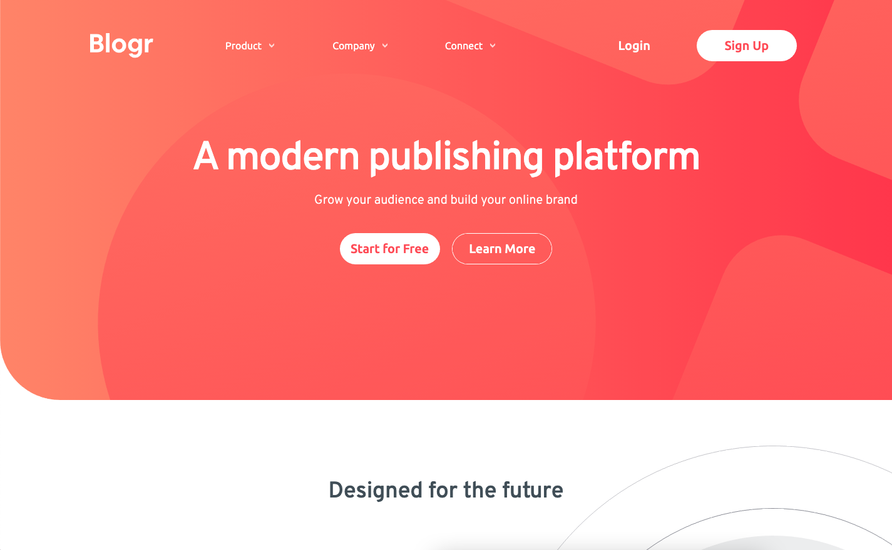

# Frontend Mentor - Blogr landing page solution

This is a solution to the [Blogr landing page challenge on Frontend Mentor](https://www.frontendmentor.io/challenges/blogr-landing-page-EX2RLAApP). Frontend Mentor challenges help you improve your coding skills by building realistic projects.

## Table of contents

- [Overview](#overview)
  - [The challenge](#the-challenge)
  - [Screenshot](#screenshot)
  - [Links](#links)
- [My process](#my-process)
  - [Built with](#built-with)
  - [Continued development](#continued-development)
- [Author](#author)

## Overview

### The challenge

Users should be able to:

- View the optimal layout for the site depending on their device's screen size
- See hover states for all interactive elements on the page

### Screenshot



### Links

- Solution URL: [https://www.frontendmentor.io/solutions/blogr-landing-page-solution-with-sass-70GJl5v1K](https://www.frontendmentor.io/solutions/blogr-landing-page-solution-with-sass-70GJl5v1K)
- Live Site URL: [https://dentednerd.github.io/fm-blogr-sass/](https://dentednerd.github.io/fm-blogr-sass/)

## My process

### Built with

- Semantic HTML5 markup
- CSS custom properties
- Flexbox
- CSS Grid
- Desktop-first workflow (different from my usual approach)

Kept the Javascript minimal:

```js
function onClick() {
  var thisItem = event.target.parentNode;
  thisItem.classList.toggle("open");
};
```

Used Sass modules with the deprecated `@import` syntax, splitting out resets, variables, mixins and some of the heavier elements. This has been a useful experience, but I think I still have some conventions to learn.

Started out using flexbox, but switched to grid later on for better responsivity.

I haven't seen any solutions that have completely nailed the size and position of the background image in the CTA. I know I haven't either, but I've done my best!

Made use of the [Live Server](https://marketplace.visualstudio.com/items?itemName=ritwickdey.LiveServer) and [Live Sass Compiler](https://marketplace.visualstudio.com/items?itemName=ritwickdey.live-sass) extensions for VSCode in development.

### Continued development

I would have approached this very differently if I'd used React and styled-components, which I want to do in the future.

I'd like to go back and add some animations eventually.

## Author

- Website - [Joey Imlay](https://joeyimlay.dev)
- Frontend Mentor - [@dentednerd](https://www.frontendmentor.io/profile/dentednerd)
- Twitter - [@dentednerd](https://www.twitter.com/dentednerd)
